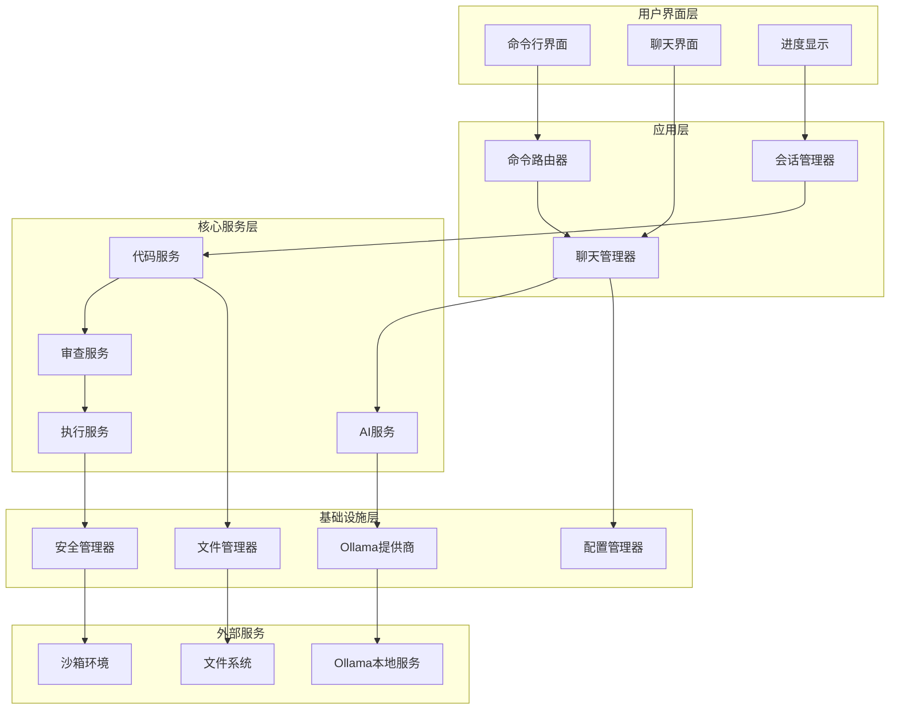
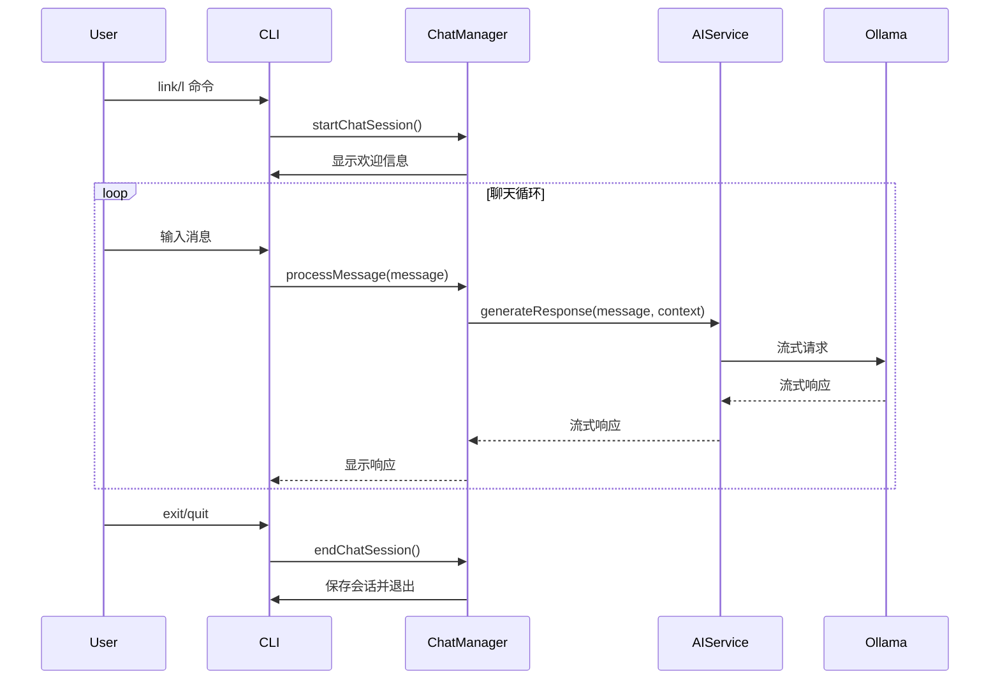
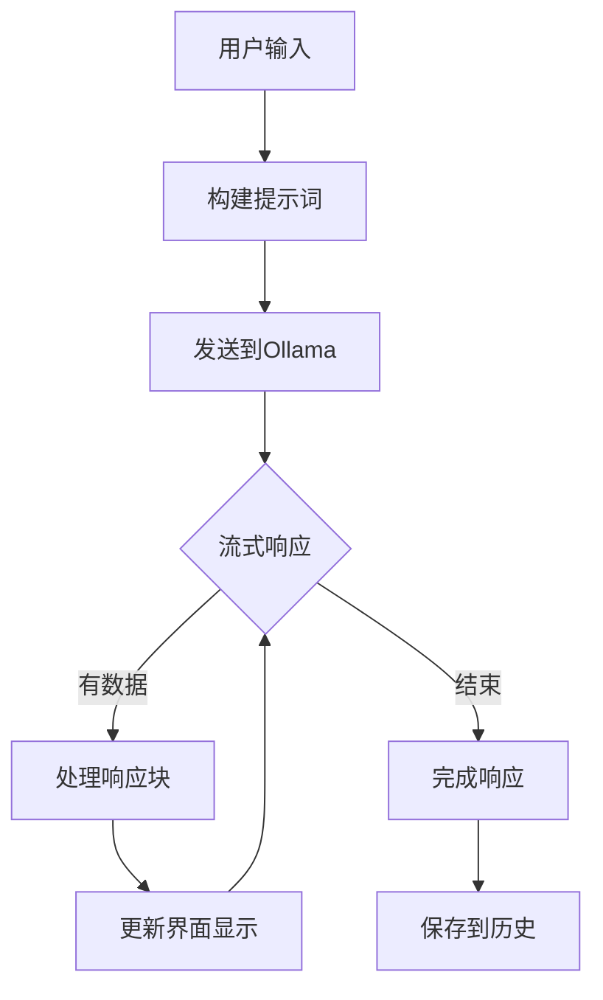
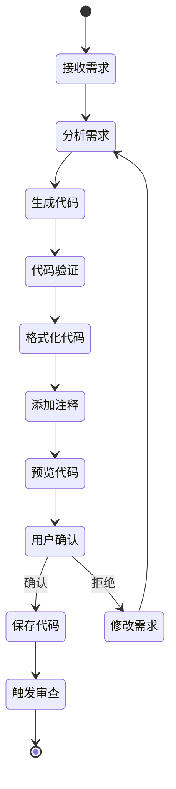
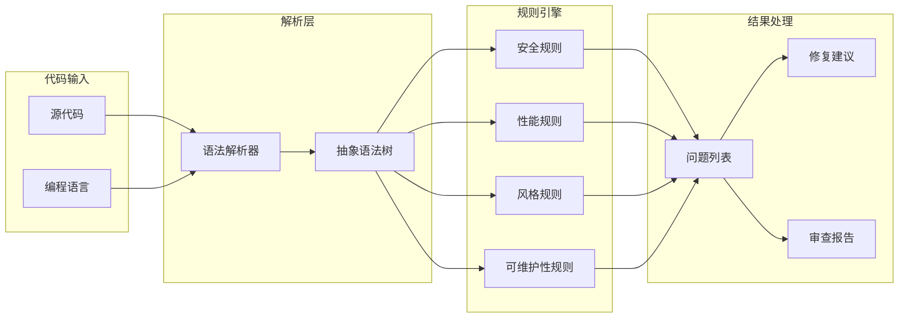
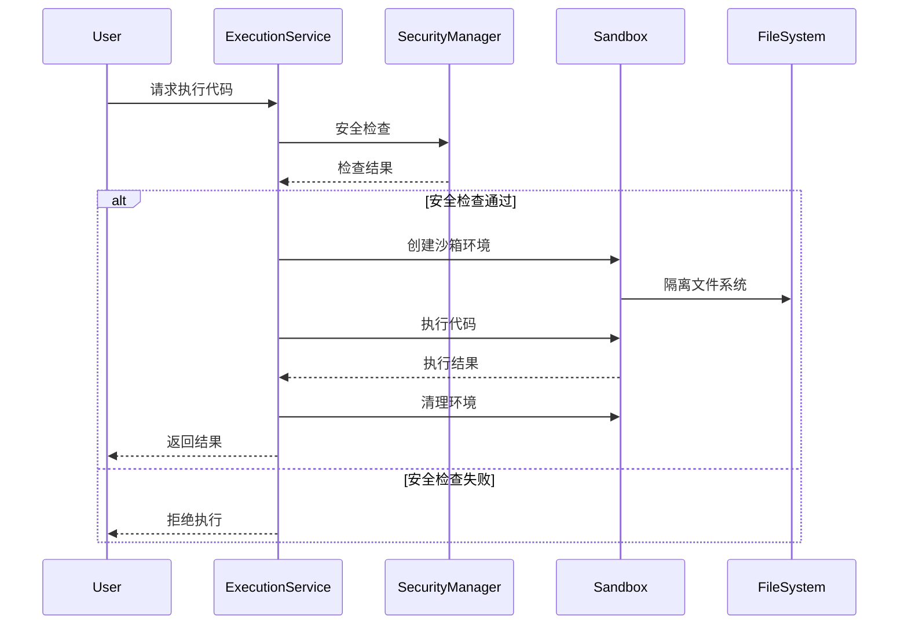
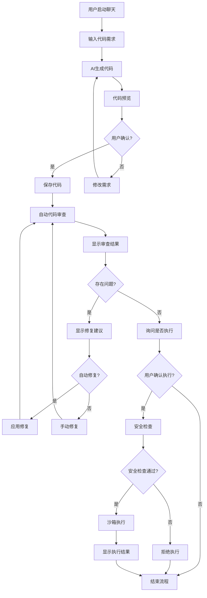
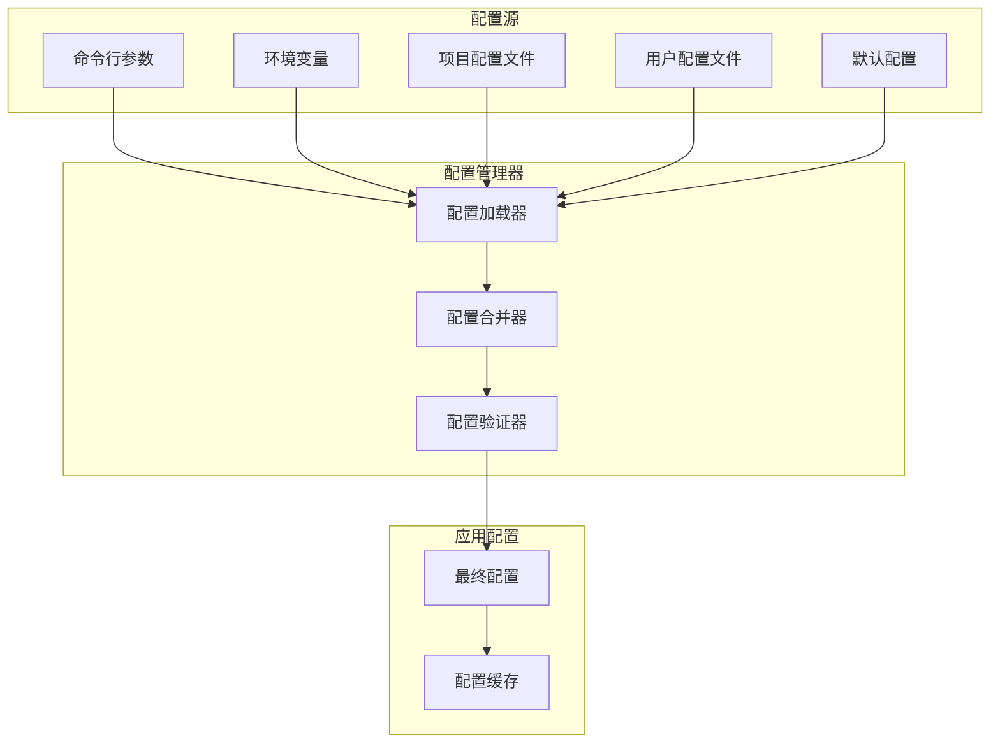
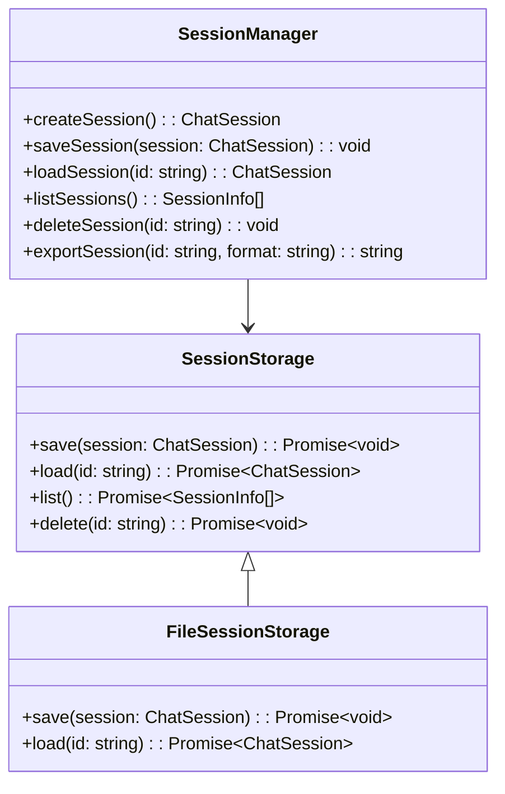

# AI CLI Chat 应用设计文档

## 项目概述

AI CLI Chat 是一个基于 Ollama 的智能命令行聊天应用，采用 TypeScript + Node.js 技术栈。应用通过 `link` 或 `l` 命令启动交互式聊天界面，支持代码生成、自动审查和任务执行的完整工作流。

## 系统架构

### 整体架构图



## 核心组件设计

### 1. 命令行界面 (CLI Interface)

#### 主入口点设计

```typescript
interface CLIApplication {
  start(): Promise<void>;
  handleCommand(command: string, args: string[]): Promise<void>;
  shutdown(): Promise<void>;
}

interface CommandRouter {
  registerCommand(name: string, handler: CommandHandler): void;
  executeCommand(command: string, args: string[]): Promise<CommandResult>;
  getAvailableCommands(): CommandInfo[];
}
```

#### 聊天界面设计



### 2. AI 服务层 (AI Service Layer)

#### Ollama 集成设计

```typescript
interface OllamaProvider {
  connect(): Promise<boolean>;
  isAvailable(): Promise<boolean>;
  listModels(): Promise<Model[]>;
  generateStream(prompt: string, options: GenerationOptions): AsyncIterable<string>;
  chat(messages: ChatMessage[], options: ChatOptions): AsyncIterable<ChatResponse>;
}

interface AIService {
  generateCode(description: string, language: string): Promise<CodeGenerationResult>;
  reviewCode(code: string, rules: ReviewRule[]): Promise<ReviewResult>;
  explainCode(code: string): Promise<string>;
  suggestImprovements(code: string): Promise<Suggestion[]>;
}
```

#### 流式响应处理



### 3. 代码服务 (Code Service)

#### 代码生成流程

```typescript
interface CodeGenerationService {
  generateCode(request: CodeGenerationRequest): Promise<CodeGenerationResult>;
  validateCode(code: string, language: string): Promise<ValidationResult>;
  formatCode(code: string, language: string): Promise<string>;
  addComments(code: string, language: string): Promise<string>;
}

interface CodeGenerationRequest {
  description: string;
  language: string;
  framework?: string;
  style?: CodeStyle;
  includeTests?: boolean;
  includeComments?: boolean;
}
```

#### 代码生成工作流



### 4. 代码审查服务 (Review Service)

#### 审查引擎设计

```typescript
interface CodeReviewService {
  reviewCode(code: string, options: ReviewOptions): Promise<ReviewResult>;
  applyFixes(code: string, fixes: AutoFix[]): Promise<string>;
  generateReport(results: ReviewResult[]): Promise<ReviewReport>;
}

interface ReviewRule {
  id: string;
  name: string;
  category: 'security' | 'performance' | 'style' | 'maintainability';
  severity: 'error' | 'warning' | 'info';
  check: (ast: AST) => ReviewIssue[];
}
```

#### 审查规则引擎



### 5. 执行服务 (Execution Service)

#### 安全执行环境

```typescript
interface ExecutionService {
  executeCode(code: string, language: string, options: ExecutionOptions): Promise<ExecutionResult>;
  createSandbox(config: SandboxConfig): Promise<Sandbox>;
  validateExecution(code: string): Promise<SecurityCheck>;
}

interface Sandbox {
  execute(code: string): Promise<ExecutionResult>;
  getOutput(): string[];
  getErrors(): string[];
  cleanup(): Promise<void>;
}
```

#### 沙箱执行流程



## 数据流设计

### 主要工作流程



## 配置系统设计

### 配置层次结构

```typescript
interface AppConfig {
  ollama: OllamaConfig;
  codeGeneration: CodeGenerationConfig;
  codeReview: CodeReviewConfig;
  execution: ExecutionConfig;
  ui: UIConfig;
  security: SecurityConfig;
}

interface OllamaConfig {
  endpoint: string;
  model: string;
  timeout: number;
  maxTokens: number;
  temperature: number;
}
```

### 配置管理流程



## 会话管理设计

### 会话数据结构

```typescript
interface ChatSession {
  id: string;
  startTime: Date;
  endTime?: Date;
  messages: ChatMessage[];
  context: SessionContext;
  metadata: SessionMetadata;
}

interface ChatMessage {
  id: string;
  role: 'user' | 'assistant' | 'system';
  content: string;
  timestamp: Date;
  metadata?: MessageMetadata;
}
```

### 会话持久化



## 安全设计

### 安全检查机制

```typescript
interface SecurityManager {
  validateCode(code: string): Promise<SecurityCheck>;
  validateFilePath(path: string): boolean;
  validateCommand(command: string): boolean;
  createSandbox(config: SandboxConfig): Promise<Sandbox>;
}

interface SecurityCheck {
  passed: boolean;
  issues: SecurityIssue[];
  recommendations: string[];
}
```

### 沙箱安全模型

```mermaid
graph TB
    subgraph "主进程"
        MainProcess[主进程]
        SecurityManager[安全管理器]
    end
    
    subgraph "沙箱环境"
        SandboxProcess[沙箱进程]
        LimitedFS[受限文件系统]
        LimitedNetwork[受限网络访问]
        ResourceLimits[资源限制]
    end
    
    subgraph "安全检查"
        CodeValidator[代码验证器]
        PathValidator[路径验证器]
        CommandValidator[命令验证器]
    end
    
    MainProcess --> SecurityManager
    SecurityManager --> CodeValidator
    SecurityManager --> PathVa  SecurityManager --> CommandValidator
    
    SecurityManager --> SandboxProcess
    SandboxProcess --> LimitedFS
  boxProcess --> LimitedNetwork
    SandboxProcess --> ResourceLimits
```

## 错误处理设计

### 错误类型层次

```typescript
abstract class AICliErronds Error {
  abstract code: string;
  abstract categoryegory;
  abstract severity: ErrorSeverity;
}

class OllamaConneError extends AICliError {
  code = 'OLLAMA_CONNECTION_ERROR';
  category = 'network';
  severity = 'high';
}

class CodeExecutionError extends AICliError {
  code = 'CODE_EXECUTION_ERROR';
  category = 'execution';
  severity = 'mediumn
### 错误恢复策略

```mermaid
flowchart TD
    A[错误发生] --> B{错误类型}
    B -->|网络错误| C[重试机制]
    B -->|配置错误| D[配置修复向导]
    B -->|执行错误| E[安滚]
    B -->|AI服务错误| F[降级处理]
    
    C --> G{重试成功?}
    G -->|是| H[继续执行]
    G -->|否| I[用户通知]
    
    D --> J[引导用户修复]
    E --> K理环境]
    F --> L[使用备用方案]
    
    I --> M[记录错误]
    J --> M
    K --> M
    L --> M
    M --> N[错误报告]
```

## 性能优化设计

### 缓``typescript
interface CacheManager {
  get<T>(key: string): Promise<T | null>;
  set<T>(key: string, value: T, ttl?: numbePromise<void>;
  invalidate(pattern: string): Promise<void>;
  clear(): Promise<void>;
}

// 缓存键策略
consEYS = {
  AI_RESPONSE: (prompt: string) => `ai:response:${hash(prompt)}`,
  CODE_REVIEW: (code: string) => `review:${hash(code)}`,
  MODEL_LIST: 'ollama:mo,
  SESSION: (id: string) => `session:${id}`
};
```

### 并发控制

```mermaid
graph LR
    subgraph "
        Queue[任务队列]
        Priority[优先级管理]
    end
    
    subgraph "并发控制"
        Semaphore[信号量]
        RateLim速率限制]
        LoadBalancer[负载均衡]
    end
    
    subgraph "执行池"
        Worker1[工作线程1]
     ker2[工作线程2]
        Worker3[工作线程3]
    end
    
    Queue --> Semaphore
    Priority --> RateLimit
    Semaphore --> LoadBalancer
    RateLimit --> LoadBalancer
    
    LoadBalancer --> Worker1
    LoadBalancer --> Worker2
    LoadBalancer --> Worker3
``n这个设计文档提供了 AI CLI Chat 应用的完整技术架构，涵盖了从用户界面到底层服务的所有关键组件。设计重点关注模块化、安全性和用户体验，确保应用能够稳定、高效地运行。