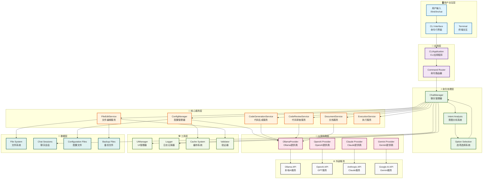
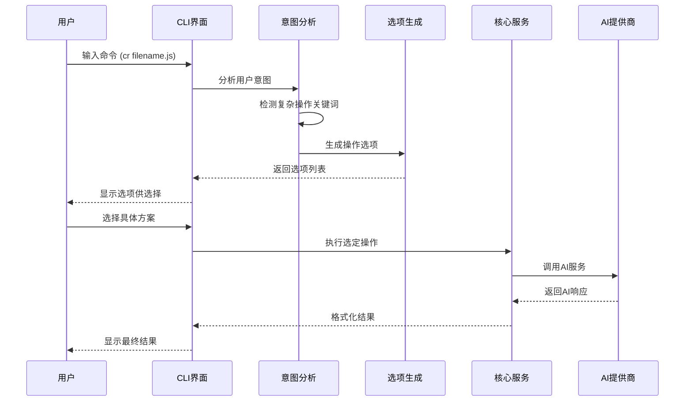
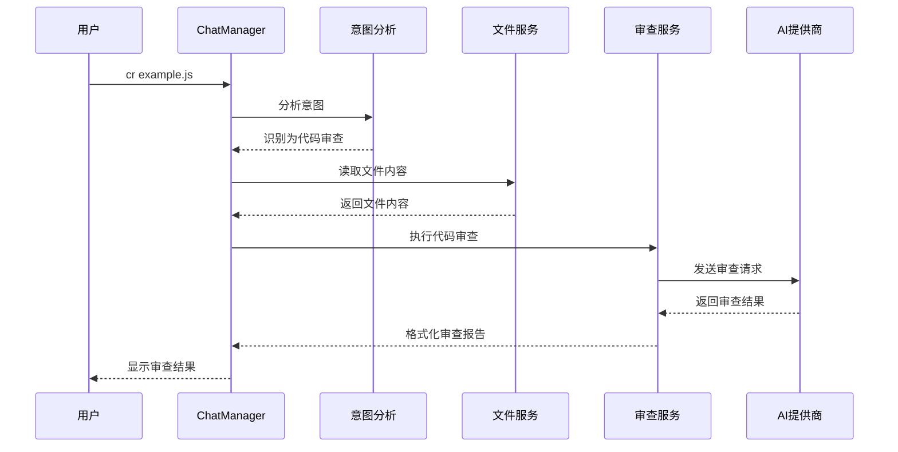
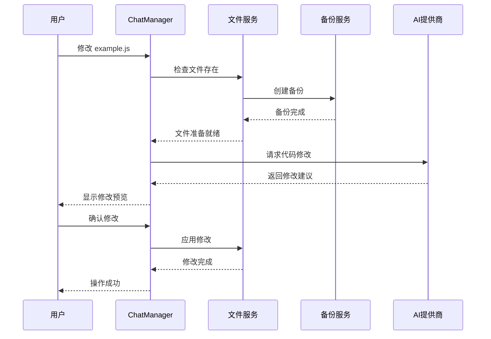

# LinChat 项目架构图

## 🏗️ 系统架构概览



## 📋 架构层次说明

### 🖥️ **用户交互层**
- **CLI Interface**: 命令行界面，处理用户输入和输出显示
- **Terminal**: 终端交互，支持 `l`、`link`、`linchat` 三种启动命令
- **用户输入**: 接收用户的自然语言指令和文件操作请求

### 🚀 **应用层**
- **CLIApplication**: 主应用程序，负责应用初始化和生命周期管理
- **Command Router**: 命令路由器，将用户输入路由到相应的处理模块

### ⚡ **命令处理层**
- **ChatManager**: 聊天管理器，核心业务逻辑处理中心
- **Intent Analysis**: 智能意图分析系统，识别用户请求类型
- **Option Selection**: 选项选择系统，为复杂操作提供多种方案

### 🔧 **核心服务层**
- **ConfigManager**: 配置管理，处理应用配置和用户设置
- **DocumentService**: 文档服务，处理Markdown、JSON、YAML等文档
- **FileEditService**: 文件编辑服务，处理文件的读写和修改
- **CodeGenerationService**: 代码生成服务，AI驱动的代码创建
- **CodeReviewService**: 代码审查服务，智能代码分析和建议
- **ExecutionService**: 执行服务，处理命令执行和结果管理

### 🤖 **AI提供商层**
- **OllamaProvider**: 本地Ollama AI服务集成
- **OpenAI Provider**: OpenAI GPT服务集成
- **Claude Provider**: Anthropic Claude服务集成
- **Gemini Provider**: Google Gemini服务集成

### 🛠️ **工具层**
- **UIManager**: UI管理器，处理界面显示和用户交互
- **Logger**: 日志记录器，系统日志和调试信息
- **Cache System**: 缓存系统，提高性能和响应速度
- **Validator**: 验证器，输入验证和数据校验

### 💾 **数据层**
- **File System**: 文件系统操作
- **Chat Sessions**: 聊天会话持久化
- **Configuration Files**: 配置文件存储
- **Backup Files**: 自动备份文件管理

### 🌐 **外部服务**
- **Ollama API**: 本地AI模型服务
- **OpenAI API**: OpenAI云端服务
- **Anthropic API**: Claude AI服务
- **Google AI API**: Gemini AI服务

## 🔄 核心工作流程

### 智能意图分析流程



### 代码审查工作流程



### 文件操作工作流程



## 🎯 架构特点

### **模块化设计**
- 清晰的层次结构，易于维护和扩展
- 每个模块职责单一，降低耦合度
- 支持插件化扩展新功能

### **智能意图分析**
- 自动识别用户需求类型
- 提供个性化操作选项
- 上下文感知的智能响应

### **多AI提供商支持**
- 灵活切换不同AI服务
- 统一的AI接口抽象
- 自动故障转移机制

### **完整的文件管理**
- 支持读写、备份、转换等操作
- 自动备份机制保护数据安全
- 智能文件路径检测

### **用户友好体验**
- 中英文文档支持
- 多种启动方式 (l/link/linchat)
- 详细的错误提示和帮助信息

### **高可扩展性**
- 插件化架构设计
- 配置驱动的功能开关
- 易于添加新的AI提供商和功能

## 🔧 技术实现亮点

### **TypeScript 类型安全**
```typescript
interface ChatMessage {
  id: string;
  role: 'user' | 'assistant';
  content: string;
  timestamp: Date;
}

interface IntentAnalysisResult {
  needsOptions: boolean;
  intent: string;
  options?: OperationOption[];
  context?: any;
}
```

### **配置管理系统**
```typescript
interface AppConfig {
  ollama: {
    endpoint: string;
    model: string;
    temperature: number;
  };
  ui: {
    language: 'zh' | 'en';
    theme: 'light' | 'dark';
  };
  features: {
    autoSave: boolean;
    backup: boolean;
    caching: boolean;
  };
}
```

### **错误处理机制**
```typescript
class LinChatError extends Error {
  constructor(
    message: string,
    public code: string,
    public userMessage: string
  ) {
    super(message);
    this.name = 'LinChatError';
  }
}
```

### **缓存优化策略**
```typescript
interface CacheConfig {
  ai: {
    enabled: boolean;
    ttl: number;
    maxSize: number;
  };
  files: {
    enabled: boolean;
    maxFiles: number;
  };
}
```

## 📊 性能优化

### **并发处理**
- AI请求限流控制
- 文件并行处理
- 内存使用优化

### **缓存策略**
- AI响应缓存
- 文件内容缓存
- 配置缓存

### **资源管理**
- 自动垃圾回收
- 内存泄漏防护
- 连接池管理

这个架构图展示了LinChat项目的完整技术架构，体现了现代AI驱动的命令行工具的设计理念和最佳实践。通过模块化设计、智能意图分析和多AI提供商支持，为用户提供了强大而灵活的AI编程助手体验。