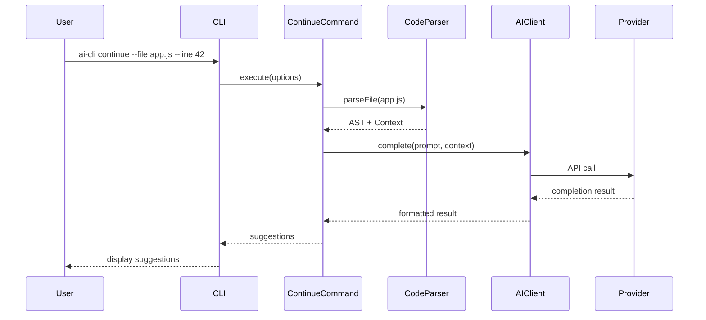
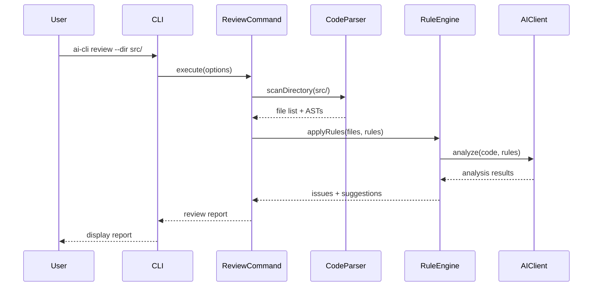
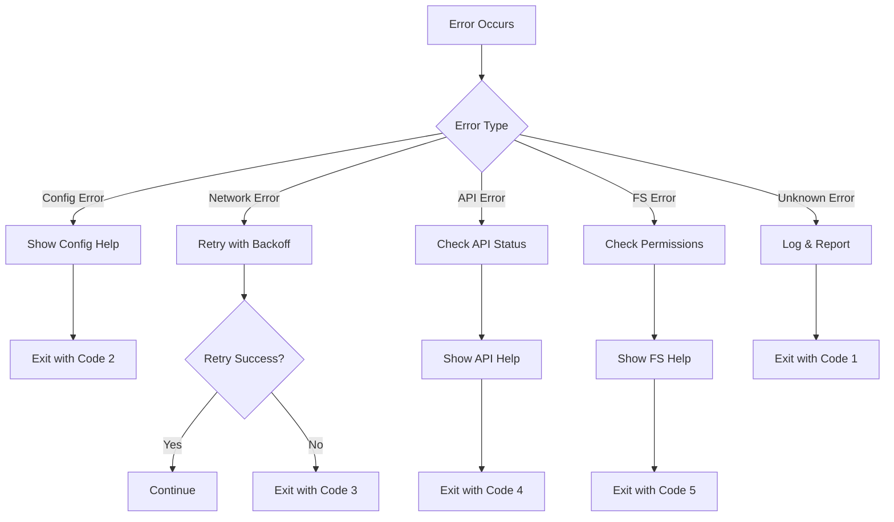

# 系统架构

## 整体架构

AI CLI采用模块化架构设计，主要由以下几个层次组成：

```
┌─────────────────────────────────────────┐
│              CLI Interface              │
├─────────────────────────────────────────┤
│            Command Layer                │
├─────────────────────────────────────────┤
│             Core Services               │
├─────────────────────────────────────────┤
│            Provider Layer               │
├─────────────────────────────────────────┤
│           External APIs                 │
└─────────────────────────────────────────┘
```

## 核心组件

### 1. CLI接口层 (CLI Interface)

负责处理用户输入和输出格式化。

```typescript
interface CLIInterface {
  parseArguments(args: string[]): ParsedArgs;
  formatOutput(data: any, format: OutputFormat): string;
  handleErrors(error: Error): void;
  displayProgress(message: string): void;
}
```

**主要职责：**
- 命令行参数解析
- 输出格式化（JSON、Markdown、HTML）
- 错误处理和用户友好的错误消息
- 进度显示和交互式提示

### 2. 命令层 (Command Layer)

实现具体的功能命令。

```typescript
abstract class BaseCommand {
  abstract execute(options: CommandOptions): Promise<CommandResult>;
  
  protected validateOptions(options: CommandOptions): void;
  protected setupLogging(): void;
  protected handleResult(result: any): void;
}

class ContinueCommand extends BaseCommand {
  async execute(options: ContinueOptions): Promise<ContinueResult> {
    // 代码续写逻辑
  }
}

class ReviewCommand extends BaseCommand {
  async execute(options: ReviewOptions): Promise<ReviewResult> {
    // 代码审查逻辑
  }
}
```

**命令类型：**
- `ContinueCommand` - 代码续写
- `ReviewCommand` - 代码审查
- `SpecCommand` - 规格生成
- `VibeCommand` - Vibe编程
- `ConfigCommand` - 配置管理

### 3. 核心服务层 (Core Services)

提供核心业务逻辑和通用服务。

#### AI客户端服务 (AIClientService)

```typescript
class AIClientService {
  private provider: AIProvider;
  private config: AIConfig;
  
  async complete(prompt: string, options: CompletionOptions): Promise<CompletionResult>;
  async chat(messages: ChatMessage[], options: ChatOptions): Promise<ChatResult>;
  async analyze(code: string, rules: AnalysisRule[]): Promise<AnalysisResult>;
}
```

#### 代码解析服务 (CodeParserService)

```typescript
class CodeParserService {
  detectLanguage(filePath: string): Language;
  parseAST(code: string, language: Language): AST;
  extractContext(code: string, line: number, contextLines: number): CodeContext;
  findDefinitions(ast: AST): Definition[];
  analyzeComplexity(ast: AST): ComplexityMetrics;
}
```

#### 文件管理服务 (FileManagerService)

```typescript
class FileManagerService {
  async readFile(path: string): Promise<string>;
  async writeFile(path: string, content: string): Promise<void>;
  async scanDirectory(path: string, options: ScanOptions): Promise<FileInfo[]>;
  async findFiles(pattern: string, options: FindOptions): Promise<string[]>;
  watchFiles(patterns: string[], callback: FileChangeCallback): FileWatcher;
}
```

#### 配置管理服务 (ConfigManagerService)

```typescript
class ConfigManagerService {
  loadConfig(path?: string): Config;
  saveConfig(config: Config, path?: string): void;
  mergeConfigs(configs: Config[]): Config;
  validateConfig(config: Config): ValidationResult;
  getDefaultConfig(): Config;
}
```

### 4. 提供商层 (Provider Layer)

抽象不同AI服务提供商的接口。

```typescript
interface AIProvider {
  name: string;
  complete(prompt: string, options: CompletionOptions): Promise<CompletionResult>;
  chat(messages: ChatMessage[], options: ChatOptions): Promise<ChatResult>;
  listModels(): Promise<Model[]>;
  validateCredentials(): Promise<boolean>;
}

class OpenAIProvider implements AIProvider {
  // OpenAI API实现
}

class AnthropicProvider implements AIProvider {
  // Anthropic API实现
}

class OllamaProvider implements AIProvider {
  // Ollama本地模型实现
}
```

## 数据流

### 代码续写流程



### 代码审查流程



## 配置系统

### 配置层次结构

```
1. 命令行参数 (最高优先级)
2. 环境变量
3. 项目配置文件 (./ai-cli.config.json)
4. 用户配置文件 (~/.ai-cli/config.json)
5. 默认配置 (最低优先级)
```

### 配置模式

```typescript
interface Config {
  api: {
    provider: 'openai' | 'anthropic' | 'gemini' | 'ollama';
    apiKey: string;
    endpoint: string;
    model: string;
    maxTokens: number;
    temperature: number;
    timeout: number;
  };
  
  continue: {
    contextLines: number;
    maxSuggestions: number;
    languages: string[];
    excludePatterns: string[];
  };
  
  review: {
    rules: {
      security: boolean;
      performance: boolean;
      maintainability: boolean;
      style: boolean;
    };
    severity: ('error' | 'warning' | 'info')[];
    outputFormat: 'json' | 'markdown' | 'html';
    includeFixSuggestions: boolean;
  };
  
  spec: {
    template: string;
    sections: string[];
    outputFormat: 'markdown' | 'html' | 'pdf';
    includeCodeExamples: boolean;
  };
  
  vibe: {
    defaultLanguage: string;
    framework: string;
    styleGuide: string;
    includeTests: boolean;
    includeComments: boolean;
  };
}
```

## 插件系统

### 插件架构

```typescript
interface Plugin {
  name: string;
  version: string;
  description: string;
  
  initialize(context: PluginContext): Promise<void>;
  execute(command: string, options: any): Promise<any>;
  cleanup(): Promise<void>;
}

class PluginManager {
  private plugins: Map<string, Plugin> = new Map();
  
  async loadPlugin(pluginPath: string): Promise<void>;
  async unloadPlugin(pluginName: string): Promise<void>;
  async executePlugin(pluginName: string, command: string, options: any): Promise<any>;
  listPlugins(): PluginInfo[];
}
```

### 内置插件

- **语言支持插件** - 扩展编程语言支持
- **框架插件** - 特定框架的代码生成
- **代码风格插件** - 不同的代码风格规则
- **输出格式插件** - 自定义输出格式

## 缓存系统

### 缓存策略

```typescript
interface CacheManager {
  get<T>(key: string): Promise<T | null>;
  set<T>(key: string, value: T, ttl?: number): Promise<void>;
  delete(key: string): Promise<void>;
  clear(): Promise<void>;
}

class FileCacheManager implements CacheManager {
  private cacheDir: string;
  
  // 基于文件系统的缓存实现
}

class MemoryCacheManager implements CacheManager {
  private cache: Map<string, CacheEntry>;
  
  // 基于内存的缓存实现
}
```

### 缓存键策略

- **代码续写**: `continue:${fileHash}:${lineNumber}:${contextHash}`
- **代码审查**: `review:${fileHash}:${rulesHash}`
- **Spec生成**: `spec:${projectHash}:${templateHash}`
- **AI响应**: `ai:${providerHash}:${promptHash}`

## 错误处理

### 错误类型层次

```typescript
abstract class AICliError extends Error {
  abstract code: string;
  abstract statusCode: number;
}

class ConfigurationError extends AICliError {
  code = 'CONFIG_ERROR';
  statusCode = 2;
}

class NetworkError extends AICliError {
  code = 'NETWORK_ERROR';
  statusCode = 3;
}

class APIError extends AICliError {
  code = 'API_ERROR';
  statusCode = 4;
}

class FileSystemError extends AICliError {
  code = 'FS_ERROR';
  statusCode = 5;
}
```

### 错误处理流程



## 性能优化

### 并发处理

```typescript
class ConcurrencyManager {
  private semaphore: Semaphore;
  
  constructor(maxConcurrency: number) {
    this.semaphore = new Semaphore(maxConcurrency);
  }
  
  async execute<T>(task: () => Promise<T>): Promise<T> {
    await this.semaphore.acquire();
    try {
      return await task();
    } finally {
      this.semaphore.release();
    }
  }
}
```

### 流式处理

```typescript
class StreamProcessor {
  async processLargeFile(filePath: string, processor: (chunk: string) => void): Promise<void> {
    const stream = fs.createReadStream(filePath, { encoding: 'utf8' });
    
    for await (const chunk of stream) {
      processor(chunk);
    }
  }
}
```

### 内存管理

- **惰性加载** - 按需加载大文件和模块
- **流式处理** - 处理大文件时使用流
- **缓存清理** - 定期清理过期缓存
- **内存监控** - 监控内存使用情况

## 安全考虑

### 输入验证

```typescript
class InputValidator {
  validateFilePath(path: string): boolean {
    // 防止路径遍历攻击
    return !path.includes('../') && !path.startsWith('/');
  }
  
  validateCode(code: string): boolean {
    // 检查恶意代码模式
    const dangerousPatterns = [
      /eval\s*\(/,
      /Function\s*\(/,
      /require\s*\(\s*['"]child_process['"]\s*\)/
    ];
    
    return !dangerousPatterns.some(pattern => pattern.test(code));
  }
}
```

### API密钥保护

- 配置文件权限限制（600）
- 内存中密钥加密存储
- 日志中密钥脱敏
- 环境变量优先级

### 沙箱执行

```typescript
class SandboxExecutor {
  async executeCode(code: string, language: string): Promise<ExecutionResult> {
    // 在隔离环境中执行代码
    const sandbox = new VM({
      timeout: 5000,
      sandbox: {
        console: {
          log: (msg: string) => this.captureOutput(msg)
        }
      }
    });
    
    return sandbox.run(code);
  }
}
```

这个架构设计确保了系统的可扩展性、可维护性和安全性，同时提供了良好的性能和用户体验。